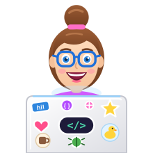

<!-- ============================================================ -->
<!-- 🌊 HEADER BANNER                                              -->
<!-- ============================================================ -->

<!-- ⌨️ TYPING TEXT: edit "lines=" to change the phrases (separate them with ;) -->

  

  
  
  

<!-- ============================================================ -->
<!-- 👋 ABOUT ME (required)                                        -->
<!-- ============================================================ -->
<h2>
  
  About Me
</h2>

- 🎓 Graduated in **Web Application Development (DAW)**
- 🚀 Currently in the Full Stack Bootcamp at **Factoría F5 Asturias**
- 💻 I work on both sides: **frontend** with Vue and TypeScript, **backend** with Java and Spring Boot
- 🧪 Passionate about **TDD**, clean code and good architecture
- 🤝 I enjoy teamwork, code reviews and learning from others
- 🌱 Always learning something new
- 🎯 Goal: start my professional career as a Full Stack Developer

 

<!-- 🔭 CURRENTLY WORKING ON: update it when you start something new -->
<h3>🔭 Currently working on</h3>

- 🍽️ Finishing **Goxu**, a full stack restaurant app with my team
- 💙 Starting my **final bootcamp project**: an app to support families caring for relatives at hospital or at home

<!-- 💪 SOFT SKILLS -->
<h3>💪 Soft Skills</h3>

  
  
  
  
  
  

<!-- ============================================================ -->
<!-- 💻 CURRENT STACK (required)                                    -->
<!-- ============================================================ -->
<h2>
  
  Current Stack
</h2>

<!-- 🎨 FRONTEND -->
<h3>🎨 Frontend</h3>

  

  
  
  
  
  
  
  
  
  

<!-- ⚙️ BACKEND -->
<h3>⚙️ Backend</h3>

  

  
  
  
  

<!-- 🗄️ DATABASES -->
<h3>🗄️ Databases</h3>

  

  
  
  
  

<!-- 🧪 TESTING -->
<h3>🧪 Testing</h3>

  
  

  
  
  
  
  
  

<!-- 🐳 DEVOPS & TOOLS -->
<h3>🐳 DevOps & Tools</h3>

  

  
  
  
  
  
  

<!-- 📋 WHAT I'VE DONE WITH EACH TECHNOLOGY -->
<h3>📋 What I've done with them</h3>

| Technology | Experience |
|---|---|
| 🌐 **HTML5 & CSS3** | Semantic layouts, Flexbox, Grid, BEM, responsive design and visual effects |
| 🎨 **Sass & Bootstrap** | Variables, nesting, reusable styles and responsive components |
| ⚡ **JavaScript** | DOM manipulation, dynamic catalogs, filters and shopping cart |
| 🔷 **TypeScript** | Typed code for safer and more maintainable apps |
| 💚 **Vue, Pinia & Vite** | SPAs with routing, state management and dashboards |
| ☕ **Java** | OOP, inheritance, interfaces, enums, collections, generics, design patterns |
| 🍃 **Spring & Spring Boot** | REST APIs with DTOs, validations, exception handling and JPA relationships |
| 🗄️ **Databases** | Normalization, Chen and crow's foot diagrams, SQL queries and JOINs |
| 🧪 **Testing** | TDD with JUnit 5 and Mockito, MockMvc, Vitest and Playwright (e2e) |
| 📮 **Postman** | Testing and documenting API endpoints |
| 🐳 **Docker** | Running MySQL with Docker Compose |
| 🔀 **Git, GitHub & Jira** | Gitflow, forks, Pull Requests and sprint management |

<!-- 🏛️ GOOD PRACTICES -->
<h3>🏛️ Good practices</h3>

| 🧪 Testing | 🏗️ Architecture | 🔀 Teamwork |
|:---:|:---:|:---:|
| TDD · Red-Green-Refactor · Coverage | MVC · Layered · SOLID · Design Patterns | Gitflow · `feat/` branches · Pull Requests · Sprints |

<!-- 🛤️ LEARNING JOURNEY: GitHub draws this diagram automatically with Mermaid -->
<h3>🛤️ My Bootcamp Journey</h3>

<!-- ============================================================ -->
<!-- 🎓 EDUCATION                                                   -->
<!-- ============================================================ -->
<h2>
  
  Education
</h2>

| 📚 Training | 🏫 Center | 📅 Status |
|---|---|:---:|
| **Full Stack Web Development Bootcamp** | Factoría F5 Asturias | 🟣 In progress |
| **Higher Technician in Web Application Development (DAW)** | IES Doctor Fleming | ✅ Completed |

<!-- ============================================================ -->
<!-- 🚀 FEATURED PROJECTS (extra): copy a 
 block to add more -->
<!-- ============================================================ -->
<h2>
  
  Featured Projects
</h2>

<!-- 🌐 FULL STACK & BACKEND -->
<h3>🌐 Full Stack & Backend</h3>

🍽️ <b>Goxu</b>: Restaurant app (team project)

 

Full restaurant app: orders, kitchen, delivery and administration. Team of 6 developers.

- 👩‍💻 **My part:** Admin Dashboard, User Dashboard, Product Detail, and orders & payments backend

🔗 [Frontend](https://github.com/AndreaVaGo/project-p5-digital-academy-team2-restaurant-frontend) · [Backend](https://github.com/AndreaVaGo/project-p5-digital-academy-team2-restaurant-backend)

🎬 <b>API Movies</b>: REST API

 

REST API to manage movies with genres, years and cast, including CRUD endpoints and a search by title or genre.

- 🏗️ Controller → Service → Repository, with DTOs, mappers and validations
- 🔗 JPA relationships: N:1 and N:M (with a join table)
- ⚠️ Custom exceptions and global error handling with `@RestControllerAdvice`
- 🧪 Tests with JUnit, Mockito and MockMvc

🔗 [Repository](https://github.com/AndreaVaGo/api-movies-)

<!-- 🎨 FRONTEND -->
<h3>🎨 Frontend</h3>

🎌 <b>OtakuHub</b>: Vue SPA (team project)

 

Single Page Application using the Jikan API, built in a team across two sprints managed in Jira.

- 🧭 Vue Router and Pinia for navigation and state management
- 🧪 Unit tests with Vitest and e2e tests with Playwright
- 🚀 Deployed on GitHub Pages

🔗 [Repository](https://github.com/FactoriaF5-Asturias/project-p5-digital-academy-team2-the-univers-of-things)

🦆 <b>DuckStore</b>: Rubber duck e-commerce (team project)

 

Static HTML/CSS shop turned into a dynamic JavaScript e-commerce.

- 🛒 Dynamic catalog, filters and shopping cart
- 👩‍💻 **My part:** dynamic catalog rendering
- 🔀 Gitflow methodology

🔗 [Repository](https://github.com/AndreaVaGo/DuckStore)

🎨 <b>HTML & CSS practice</b>: Grid, Flexbox and visual effects

 

Layout and styling exercises from the first weeks of the bootcamp.

- 🔲 [Utilizando-Grid](https://github.com/AndreaVaGo/Utilizando-Grid): responsive color panel with BEM and CSS custom properties
- 📦 [Utilizando-Flexbox](https://github.com/AndreaVaGo/Utilizando-Flexbox): Flexbox layouts
- ✨ [css-visual-effects](https://github.com/AndreaVaGo/css-visual-effects): CSS visual effects
- ⚡ [micro-exercises-js](https://github.com/AndreaVaGo/micro-exercises-js): JavaScript exercises tested with Vitest

<!-- ☕ JAVA & TDD -->
<h3>☕ Java & TDD</h3>

📔 <b>Inside Out</b>: Console diary app

 

Console app to record life moments linked to emotions.

- 🏗️ Layered architecture: View → Controller → Service → Repository → DAO, with DTOs and Mappers

🔗 [Repository](https://github.com/AndreaVaGo/project-java-consoleapp-inside-out)

⚔️ <b>RPG Combat Kata</b>: TDD practice

 

TDD kata in 5 iterations: damage, levels, range, factions and damageable props.

🔗 [Repository](https://github.com/AndreaVaGo/kata-java-tdd-RPG-Combat)

🏦 <b>Bank Account</b>: Inheritance in Java

 

Bank account model with a base class and two child classes: savings account and checking account.

- 🧬 Inheritance, encapsulation and method overriding
- 🧪 Parameterized tests and UML class diagram

🔗 [Repository](https://github.com/AndreaVaGo/cuenta-bancaria)

🏠 <b>House Builder</b>: Builder design pattern

 

Implementation of the Builder pattern to create houses with optional features: garage, garden, swimming pool and statues.

- 🧩 Builder interface, concrete builder and director
- 🧪 Unit tests with coverage and class diagram

🔗 [Repository](https://github.com/AndreaVaGo/ex-java-design_patterns-house_builder)

<!-- ============================================================ -->
<!-- 📊 GITHUB STATS (optional): generated automatically            -->
<!-- ============================================================ -->
<h2>
  
  GitHub Stats
</h2>

  
  

<!-- 🔥 STREAK: consecutive days with contributions -->

  

<!-- 🐍 SNAKE: only appears after running the snake.yml workflow. Delete this block if you don't want it -->

  

<!-- ============================================================ -->
<!-- 📫 CONTACT (required)                                          -->
<!-- ============================================================ -->
<h2>
  
  Contact
</h2>

  Feel free to reach out! I'm always open to new opportunities, collaborations and a good chat about code 💬

  
  

<!-- 💬 QUOTE -->

  <i>"Every expert was once a beginner. Keep coding, keep learning."</i> 💜

<!-- 🌊 FOOTER BANNER -->

